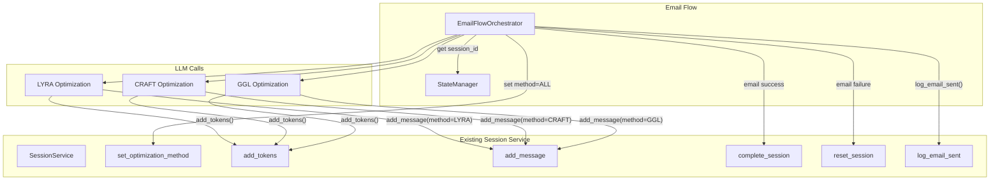

# Design Document: Email Flow Session Tracking

## Overview

This feature extends the existing session tracking system to support the "Send 3 prompts to email" flow. The implementation maximizes reuse of existing `SessionService` methods with minimal code changes:

1. **Enum Extension**: Add "ALL" value to `OptimizationMethod` enum
2. **Method Extension**: Add optional `method` parameter to `add_message()` for conversation history attribution
3. **Integration**: Call existing session tracking methods from `EmailFlowOrchestrator`

**Key Reuse Points:**
- `set_optimization_method(session_id, OptimizationMethod.ALL)` - set method to "ALL"
- `add_tokens(session_id, input, output)` - called 3 times, once per optimization
- `add_message(session_id, role, content, method)` - extended with optional method param
- `complete_session(session_id)` - mark successful after email sent
- `reset_session(session_id)` - mark unsuccessful if email fails
- `log_email_sent(session_id, email, status)` - log single email event

## Architecture



### Component Interaction Flow

1. **Email Flow Start**: User clicks "Send 3 prompts to email" button
2. **Get Session**: `EmailFlowOrchestrator` retrieves `session_id` from `StateManager` (session was created when user submitted prompt)
3. **Set Method**: Call `set_optimization_method(session_id, OptimizationMethod.ALL)`
4. **Run Optimizations**: For each method (LYRA, CRAFT, GGL):
   - Execute LLM call
   - Call `add_tokens(session_id, input_tokens, output_tokens)`
   - Call `add_message(session_id, "assistant", response, method="LYRA|CRAFT|GGL")`
5. **Send Email**: Send email with all 3 results
6. **Complete Session**:
   - If email succeeds: Call `complete_session(session_id)` and `log_email_sent(session_id, email, "sent")`
   - If email fails: Call `reset_session(session_id)` and `log_email_sent(session_id, email, "failed")`

## Components and Interfaces

### 1. OptimizationMethod Enum (Modified)

Location: `telegram_bot/services/session_service.py`

```python
class OptimizationMethod(str, Enum):
    """Optimization method enumeration."""
    
    LYRA = "LYRA"
    CRAFT = "CRAFT"
    GGL = "GGL"
    ALL = "ALL"  # NEW: For email flow with all 3 methods
```

### 2. SessionService.add_message() (Extended)

Location: `telegram_bot/services/session_service.py`

```python
def add_message(
    self,
    session_id: int,
    role: str,
    content: str,
    method: str | None = None,  # NEW: Optional method attribution
) -> SessionModel | None:
    """
    Add a message to the session's conversation history (JSONB).
    
    Args:
        session_id: ID of the session to add message to
        role: Message role - "user" or "assistant"
        content: Message content text
        method: Optional optimization method that produced this response
                (LYRA, CRAFT, GGL). Used for email flow attribution.
    
    Returns:
        Updated Session instance, or None on error (logged)
    """
    try:
        session = self._db_session.get(SessionModel, session_id)
        if session is None:
            logger.warning(f"Session {session_id} not found for message addition")
            return None

        # Create message object with ISO8601 timestamp
        message = {
            "role": role,
            "content": content,
            "timestamp": datetime.now(UTC).isoformat(),
        }
        
        # Add method attribution if provided (for email flow)
        if method:
            message["method"] = method

        # Append to conversation history
        current_history = session.conversation_history or []
        session.conversation_history = [*current_history, message]

        self._db_session.commit()
        self._db_session.refresh(session)
        return session
    except Exception as e:
        logger.error(f"Failed to add message to session {session_id}: {e}")
        self._db_session.rollback()
        return None
```

### 3. EmailFlowOrchestrator Integration Points

Location: `telegram_bot/flows/email_flow.py`

The following methods need to be modified to add session tracking:

#### 3.1 `_run_direct_optimization_and_email_delivery()`

Add session tracking calls:
- Get `session_id` from `StateManager`
- Call `set_optimization_method(session_id, OptimizationMethod.ALL)`
- After email result, call `complete_session()` or `reset_session()`
- Call `log_email_sent()`

#### 3.2 `_run_all_optimizations_with_modified_prompts()`

Add token and message tracking for each method:
- After each LLM call, get token usage
- Call `add_tokens(session_id, input_tokens, output_tokens)`
- Call `add_message(session_id, "assistant", response, method=method_name)`

#### 3.3 `_run_all_optimizations()`

Same as above - add token and message tracking for each method.

### 4. StateManager (No Changes)

The existing `StateManager` already provides:
- `get_current_session_id(user_id)` - retrieve session ID
- `set_current_session_id(user_id, session_id)` - store session ID

These are already used by `BotHandler` and will be reused by `EmailFlowOrchestrator`.

## Data Models

### Conversation History JSONB Structure (Extended)

```json
[
  {
    "role": "user",
    "content": "Original prompt text...",
    "timestamp": "2025-12-21T10:00:00Z"
  },
  {
    "role": "assistant",
    "content": "LYRA optimized prompt...",
    "timestamp": "2025-12-21T10:00:05Z",
    "method": "LYRA"
  },
  {
    "role": "assistant",
    "content": "CRAFT optimized prompt...",
    "timestamp": "2025-12-21T10:00:10Z",
    "method": "CRAFT"
  },
  {
    "role": "assistant",
    "content": "GGL optimized prompt...",
    "timestamp": "2025-12-21T10:00:15Z",
    "method": "GGL"
  }
]
```

**Note**: The `method` field is optional and only present for assistant messages in email flow. This maintains backward compatibility with existing conversation history entries.

## Correctness Properties

*A property is a characteristic or behavior that should hold true across all valid executions of a system.*

### Property 1: Email flow sessions have method "ALL"
*For any* session where the email flow is triggered, the `optimization_method` field SHALL be set to "ALL" before any optimizations are executed.
**Validates: Requirements 1.2, 6.2**

### Property 2: Token accumulation across all methods
*For any* email flow session, the final `tokens_total` SHALL equal the sum of input and output tokens from all three optimization methods (LYRA + CRAFT + GGL).
**Validates: Requirements 2.1, 2.2, 2.3, 2.4**

### Property 3: Conversation history contains all method responses
*For any* completed email flow session, the conversation history SHALL contain exactly 3 assistant messages with `method` field set to "LYRA", "CRAFT", and "GGL" respectively.
**Validates: Requirements 3.1, 3.2**

### Property 4: Session completion reflects email delivery status
*For any* email flow session, if email delivery succeeds then status SHALL be "successful", and if email delivery fails then status SHALL be "unsuccessful".
**Validates: Requirements 5.1, 5.2**

### Property 5: Single email event per email flow
*For any* email flow session, there SHALL be exactly one email event record created, regardless of how many optimization methods were used.
**Validates: Requirements 4.1, 4.2, 4.3**

### Property 6: Backward compatibility of add_message
*For any* call to `add_message()` without the `method` parameter, the resulting conversation history entry SHALL NOT contain a `method` field.
**Validates: Requirements 3.3, 3.4**

## Error Handling

### Design Principle: Graceful Degradation (Inherited)

The email flow session tracking inherits the graceful degradation principle from the existing session tracking system. All session operations:
1. Log errors with full context
2. Return `None` or continue execution
3. Never block the user's email delivery

### Error Scenarios

| Operation | Error Handling | User Impact |
|-----------|---------------|-------------|
| `set_optimization_method()` fails | Log error, continue | None - email still sent |
| `add_tokens()` fails | Log error, continue | None - tokens not tracked |
| `add_message()` fails | Log error, continue | None - history incomplete |
| `complete_session()` fails | Log error, continue | None - session status not updated |
| `log_email_sent()` fails | Log error, continue | None - email event not logged |

## Testing Strategy

### Unit Tests

1. **OptimizationMethod enum tests**:
   - Test "ALL" value is valid
   - Test `set_optimization_method()` accepts "ALL"

2. **add_message() extension tests**:
   - Test with `method` parameter adds field to JSONB
   - Test without `method` parameter (backward compatibility)
   - Test method field values (LYRA, CRAFT, GGL)

### Property-Based Tests

The implementation will use `hypothesis` for property-based testing.

```python
# **Feature: email-flow-session-tracking, Property 2: Token accumulation across all methods**
# **Validates: Requirements 2.1, 2.2, 2.3, 2.4**
```

### Integration Tests

1. **Full email flow with session tracking**:
   - Start session → email flow → verify method="ALL"
   - Verify tokens accumulated from all 3 methods
   - Verify conversation history has 3 method-attributed messages
   - Verify single email event created
   - Verify session status based on email result

2. **Graceful degradation tests**:
   - Simulate session service failures
   - Verify email flow completes successfully despite tracking failures

