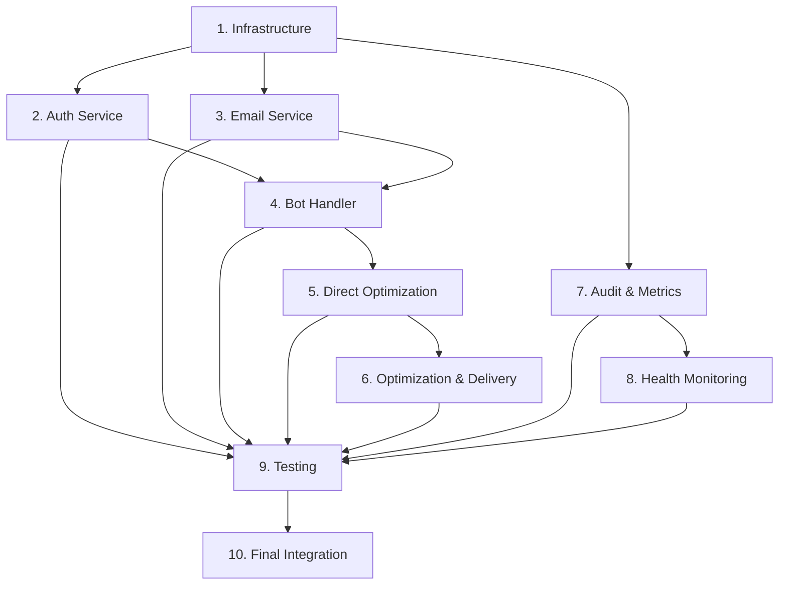

# Implementation Plan

## Overview

This implementation plan breaks down the email-prompt-delivery feature into manageable, incremental tasks. Each task builds on previous work and includes specific requirements, testing criteria, and integration points. The plan follows test-driven development principles and ensures early validation of core functionality.

## Task Execution Guidelines

- Execute tasks in sequential order (dependencies are clearly marked)
- Complete all sub-tasks before marking parent task as complete
- Write tests before implementing functionality (TDD approach)
- Validate each task against requirements before proceeding
- Ensure proper logging and error handling in each component

## Implementation Tasks

- [x] 1. Set up project infrastructure and dependencies

  - Create database models and migration system
  - Set up Redis client and connection management
  - Configure environment variables and settings
  - _Requirements: 6.4, 6.5, 6.6, 6.7_

- [x] 1.1 Create database models and schema

  - Implement User and AuthEvent SQLAlchemy models in `src/database.py`
  - Add proper indexes for performance (telegram_id, email, created_at combinations)
  - Create Alembic configuration and initial migration
  - Test model creation, constraints, and index performance
  - _Requirements: 6.1, 6.2, 6.3, 6.6_

- [x] 1.2 Implement Redis client and connection management

  - Create `src/redis_client.py` with connection pooling
  - Implement OTP storage, rate limiting, and flow state operations
  - Add Redis health checks and error handling
  - Test Redis operations with TTL and key management
  - _Requirements: 2.4, 2.5, 2.6_

- [x] 1.3 Extend configuration management

  - Update `src/config.py` with database, Redis, SMTP, and audit settings
  - Add environment variable validation and defaults
  - Implement SMTP port selection logic (TLS/SSL)
  - Test configuration loading and validation
  - _Requirements: 8.6_

- [x] 1.4 Finalize schema constraints and email field handling

  - Add UNIQUE constraints to users.email (normalized) and users.telegram_id
  - Ensure both email (normalized) and email_original (exact user input) are persisted
  - Create migration to enforce constraints and verify schema integrity
  - Test uniqueness violations and email normalization behavior comprehensively
  - _Requirements: 6.2, 6.6, 6.7_

- [x] 2. Implement authentication service with OTP functionality

  - Create core authentication logic with OTP generation and verification
  - Implement comprehensive rate limiting system
  - Add audit logging for all authentication events
  - _Requirements: 2.1, 2.2, 2.3, 2.4, 2.5, 2.6, 2.7_

- [x] 2.1 Create OTP generation and hashing system

  - Implement 6-digit numeric OTP generation in `src/auth_service.py`
  - Add Argon2id hashing with proper salt handling
  - Create OTP storage in Redis with 5-minute TTL
  - Test OTP generation, hashing, and Redis storage
  - _Requirements: 2.4_

- [x] 2.2 Implement comprehensive rate limiting

  - Add email-based rate limiting (3/hour per normalized email)
  - Add user-based rate limiting (5/hour per telegram_id)
  - Add spacing enforcement (60s minimum between sends)
  - Test all rate limiting scenarios including edge cases
  - _Requirements: 2.5_

- [x] 2.3 Create OTP verification system

  - Implement OTP verification with attempt counting (max 3 attempts)
  - Add proper error handling for expired, invalid, and exceeded attempts
  - Implement Redis cleanup on success or failure
  - Test verification success, mismatch, expiry, and attempt limit scenarios
  - _Requirements: 2.6, 2.7_

- [x] 2.4 Persist authentication state on OTP success

  - On first successful OTP verification: set `is_authenticated=true` and `email_verified_at`
  - On every successful verification: update `last_authenticated_at` timestamp
  - Implement user record upsert using normalized email, preserve `email_original`
  - Add comprehensive unit tests for first-success vs subsequent-success paths
  - _Requirements: 3.1, 3.2, 3.3, 6.6_

- [x] 2.5 Make Redis OTP record complete and attempt-aware

  - Store complete OTP context in Redis: `otp_hash`, `normalized_email`, `attempts`, `expires_at`
  - Implement attempt counter increment and persistence on every verification attempt
  - Delete OTP key after >3 failed attempts or on successful verification
  - Add comprehensive tests for attempt boundaries, expiry handling, and key cleanup
  - _Requirements: 2.4, 2.6; Design: Redis key structure_

- [x] 3. Implement email service with SMTP integration

  - Create email sending functionality with SMTP-Pulse integration
  - Implement email templates with multilingual support
  - Add email delivery error handling and fallback logic
  - _Requirements: 5.1, 5.2, 5.3, 5.4, 7.1, 7.2, 7.3, 7.4, 7.5, 7.6, 7.7, 8.1, 8.2, 8.4, 8.5_

- [x] 3.1 Create SMTP client and connection management

  - Implement `src/email_service.py` with SMTP-Pulse integration
  - Add support for both TLS (587) and SSL (465) connections
  - Implement connection pooling and retry logic
  - Test SMTP connections, authentication, and error handling
  - _Requirements: Configuration from design document_

- [x] 3.2 Implement email templates and content formatting

  - Create `src/email_templates.py` with RU/EN template support
  - Implement HTML email composition with proper escaping
  - Add support for code blocks using `<pre><code>` tags
  - Test template rendering, language selection, and content escaping
  - _Requirements: 7.1, 7.2, 7.3, 7.4, 7.6, 7.7, 8.2, 8.4, 8.5_

- [x] 3.3 Create email delivery system with fallback handling

  - Implement email sending with delivery confirmation
  - Add fallback logic for email delivery failures
  - Implement idempotent email sending (webhook replay protection)
  - Test successful delivery, failure scenarios, and strict fallback behavior
  - _Requirements: 5.1, 5.2, 5.3, 5.4_

- [x] 3.4 Add retry queue for email when SMTP is unhealthy

  - On SMTP failure, enqueue the composed email for automatic retry when health recovers
  - Background worker drains the queue once SMTP health flips to healthy
  - Keep idempotency to avoid duplicate sends; audit each attempt (EMAIL_SEND_OK / EMAIL_SEND_FAIL with reason)
  - Test queueing, retry after recovery, and idempotency
  - _Requirements: 9.2; Design: Graceful degradation & queue on SMTP down_

- [x] 4. Extend bot handler with email authentication flow

  - Add "Send 3 prompts to email" button to method selection screen
  - Implement email input and OTP verification conversation flow
  - Integrate with existing conversation management system
  - _Requirements: 1.1, 1.2, 1.3, 1.4, 2.1, 2.2, 2.3_

- [x] 4.1 Add email delivery button to UI

  - Extend `src/messages.py` with new button definition
  - Update method selection keyboard to include email button
  - Ensure button appears above existing CRAFT/LYRA/GGL buttons
  - Test button display and user interaction
  - _Requirements: 1.1_

- [x] 4.2 Implement email input and validation flow

  - Add email input handler to `src/bot_handler.py`
  - Implement email format validation and normalization
  - Add user-friendly error messages in RU/EN
  - Test email input, validation, and error handling
  - _Requirements: 1.2, 2.1, 2.2, 2.3_

- [x] 4.3 Create OTP verification conversation flow

  - Implement OTP input handler with attempt tracking
  - Add proper error messages for invalid, expired, and exceeded attempts
  - Integrate with authentication service for verification
  - Test OTP input flow and all error scenarios
  - _Requirements: 2.6, 2.7_

- [x] 4.4 Bypass OTP for already-authenticated users

  - On "Send 3 prompts to email", if users.is_authenticated is true for this telegram_id, skip OTP and proceed directly to optimization → delivery
  - Make sure the flow still uses the stored (normalized) email
  - Integration tests for the "returning user" path
  - _Requirements: 1.4_

- [x] 4.5 Gate the flow with health checks (bot-level)

  - Before starting email auth: require Redis healthy; otherwise show temporary-unavailable message and stop
  - Before sending email: require SMTP healthy; otherwise show error message in chat (no prompt sharing)
  - Tests covering unhealthy → healthy transitions and user messaging
  - _Design: Health check integration in bot handler_

- [x] 5. Create direct optimization workflow

  - Skip follow-up questions and proceed directly to optimization
  - Implement system prompt modification for optimization methods
  - Add proper state management for direct optimization flow
  - _Requirements: 4.1, 4.2, 4.3, 4.4, 4.5_

- [x] 5.1 Create email flow orchestration

  - Implement `src/email_flow.py` as main workflow coordinator
  - Integrate authentication and direct optimization (skip follow-up questions)
  - Add proper state management throughout the flow
  - Test complete workflow integration
  - _Requirements: 4.1, 4.2, 4.3, 4.4, 4.5_

- [x] 5.2 Implement email-specific prompt loading for optimization methods

  - Modify PromptLoader to load email-specific prompt files: CRAFT_email_prompt.txt, LYRA_email_prompt.txt, GGL_email_prompt.txt
  - Remove constant string appending from email flow - use email prompts directly
  - Ensure original system prompts remain unchanged for regular optimization use cases
  - Test email-specific prompt loading for all three methods
  - _Requirements: 4.3, 4.4, 4.7_

- [x] 5.3 Add direct optimization flow without follow-up questions

  - Remove follow-up questions integration from email flow
  - Use original user prompt directly for optimization
  - Ensure seamless transition from authentication to optimization
  - Test direct optimization flow and state management
  - _Requirements: 4.1, 4.2_

- [x] 6. Implement prompt optimization and email delivery

  - Run all three optimization methods (CRAFT, LYRA, GGL) on original prompt with modified system prompts
  - Compose and send comprehensive email with all results
  - Add proper error handling with error-only chat messages
  - _Requirements: 4.3, 4.4, 4.5, 5.1, 5.2, 5.4, 7.7_

- [x] 6.1 Create prompt optimization coordination with email-specific prompts

  - Integrate with existing CRAFT, LYRA, GGL optimization methods
  - Use email-specific prompts directly (no runtime modification needed)
  - Run all three methods on the original user prompt (no follow-up improvement)
  - Collect and format results for email delivery
  - Test optimization integration with email-specific prompts
  - _Requirements: 4.3, 4.4, 4.5, 4.7_

- [x] 6.2 Implement comprehensive email composition

  - Create email content with original prompt and all three optimizations
  - Add clear labeling for each method (CRAFT, LYRA, GGL)
  - Include professional signature and proper formatting
  - Remove any reference to follow-up improved prompts
  - Test email composition with various prompt types and content
  - _Requirements: 5.4, 7.2, 7.3, 7.5, 7.7_

- [x] 6.3 Add email delivery with error-only chat handling

  - Send composed email to authenticated user
  - On email failure: show only error message in chat (no optimized prompts)
  - Add success/failure notifications to user
  - Test email delivery success and error-only failure scenarios
  - _Requirements: 5.1, 5.2_

- [x] 6.4 Ensure a clear, localized subject line for optimization emails

  - Subject must explicitly indicate it contains "3 optimized prompts" (localized via global LANGUAGE)
  - Tests assert subject content and language selection
  - _Requirements: 7.1, 8.2, 8.4_

- [x] 7. Implement audit logging and metrics collection

  - Create comprehensive audit trail for all authentication and email events
  - Implement metrics collection for monitoring and observability
  - Add audit event purging with configurable retention
  - _Requirements: 9.1, 9.2, 9.3_

- [x] 7.1 Create audit service with event logging

  - Implement `src/audit_service.py` with comprehensive event logging
  - Log all OTP and email events to auth_events table
  - Ensure proper data masking and PII protection
  - Test audit event creation and database storage
  - _Requirements: 9.1, 9.2_

- [x] 7.2 Implement metrics collection system

  - Create `src/metrics.py` with counters for all required metrics
  - Add OTP metrics (sent, verified, failed, expired)
  - Add email metrics (ok, fail) and latency tracking (LLM, SMTP)
  - Test metrics collection and export functionality
  - _Requirements: Observability requirements from design_

- [x] 7.3 Add audit event purging with retention policy

  - Implement configurable retention period (default 90 days)
  - Create background task for daily audit event cleanup
  - Add proper logging for purge operations
  - Test purging logic and retention policy enforcement
  - _Requirements: 9.3_

- [x] 7.4 Capture provider error info in audit events on email failures

  - When email send fails, save error reason (non-sensitive) in auth_events.reason
  - Tests validate that EMAIL_SEND_FAIL events include reason text
  - _Requirements: 9.2_

- [x] 8. Implement health monitoring and system observability

  - Create health checks for all external dependencies
  - Add comprehensive logging with proper PII masking
  - Implement graceful degradation for service failures
  - _Requirements: Design document health monitoring requirements_

- [x] 8.1 Create health monitoring system

  - Implement `src/health_checks.py` with database, Redis, and SMTP health checks
  - Add periodic health monitoring with alerting
  - Create health status reporting and logging
  - Test health checks and failure detection
  - _Requirements: Design document health monitoring_

- [x] 8.2 Implement comprehensive logging with PII protection

  - Add structured logging throughout all components
  - Implement email and telegram ID masking functions
  - Ensure no sensitive data (OTPs, credentials) in logs
  - Test logging output and PII masking effectiveness
  - _Requirements: Security considerations from design_

- [x] 8.3 Add graceful degradation for service failures

  - Implement fallback behavior when Redis is unavailable
  - Add fallback to chat delivery when SMTP fails
  - Create user-friendly error messages for service degradation
  - Test system behavior during various service failure scenarios
  - _Requirements: Design document graceful degradation_

- [x] 9. Create comprehensive test suite

  - Implement unit tests for all new components
  - Create integration tests for complete workflows
  - Add performance and security tests
  - _Requirements: All requirements validation through testing_

- [x] 9.1 Implement unit tests for core components

  - Create `tests/test_auth_service.py` with comprehensive OTP and rate limiting tests
  - Create `tests/test_email_service.py` with SMTP and template tests
  - Create `tests/test_database.py` with model and migration tests
  - Test all critical scenarios including edge cases
  - _Requirements: All component requirements_

- [x] 9.2 Create integration and end-to-end tests

  - Implement `tests/test_email_flow_integration.py` for complete workflow testing
  - Create `tests/test_bot_handler_integration.py` for UI integration
  - Add tests for system prompt modification and direct optimization flow
  - Test complete user journeys from button click to email delivery (no follow-up questions)
  - Test error-only handling when email delivery fails
  - _Requirements: All integration requirements_

- [x] 9.3 Add performance and security tests

  - Create `tests/test_performance.py` for load and latency testing
  - Implement `tests/test_security.py` for security vulnerability testing
  - Add tests for rate limiting bypass attempts and data masking
  - Test system behavior under concurrent load
  - _Requirements: Security and performance requirements_

- [x] 10. Final integration and deployment preparation

  - Integrate all components with existing bot system
  - Update deployment configuration and documentation
  - Perform final testing and validation
  - _Requirements: All requirements final validation_

- [x] 10.1 Complete system integration

  - Integrate email flow with existing bot startup and shutdown procedures
  - Update main application to start background tasks (health monitoring, audit purging)
  - Ensure proper error handling and logging throughout the system
  - Test complete system integration and startup/shutdown procedures
  - _Requirements: All system integration requirements_

- [x] 10.2 Update deployment configuration

  - Update `docker-compose.yml` with Redis and PostgreSQL services
  - Add environment variable documentation and examples
  - Create database migration deployment procedures
  - Test deployment configuration in staging environment
  - _Requirements: Deployment considerations from design_

- [x] 10.3 Modify email prompt delivery to use dedicated email prompt files

  - Remove NO_FOLLOWUP_INSTRUCTION constant string appending from email_flow.py
  - Update PromptLoader to load email-specific prompt files (CRAFT_email_prompt.txt, LYRA_email_prompt.txt, GGL_email_prompt.txt)
  - Modify email flow to use email-specific prompts directly without runtime modification
  - Update tests to validate email-specific prompt loading and usage
  - _Requirements: 4.3, 4.7_

- [x] 10.4 Perform final validation and testing

  - Run complete test suite with >90% coverage validation
  - Perform end-to-end testing with real SMTP service (in staging)
  - Validate all observability features (metrics, logging, health checks)
  - Conduct security review and penetration testing
  - _Requirements: All requirements final validation_

## Task Dependencies

## Success Criteria

Each task is considered complete when:

1. **Functionality**: All specified features work as designed
2. **Testing**: Comprehensive tests pass with >90% coverage
3. **Security**: No sensitive data exposure, proper rate limiting
4. **Performance**: Meets latency and throughput requirements
5. **Observability**: Proper logging, metrics, and health monitoring
6. **Integration**: Seamless integration with existing systems
7. **Documentation**: Code is well-documented and maintainable

## Risk Mitigation

- **Redis Dependency**: Implement graceful degradation when Redis is unavailable
- **SMTP Reliability**: Show error messages in chat when email delivery fails (no prompt sharing)
- **Rate Limiting**: Comprehensive testing to prevent bypass attempts
- **Data Security**: Multiple layers of PII protection and audit trails
- **Performance**: Load testing and optimization at each integration point
- **Rollback**: Database migrations with rollback capability for safe deployment