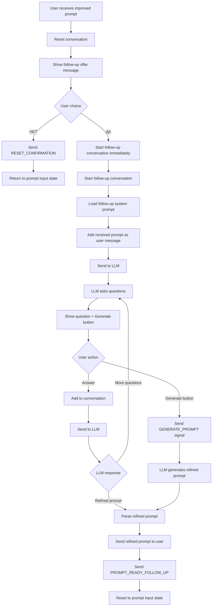
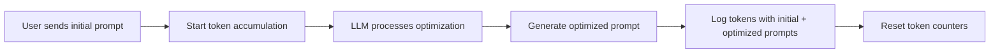
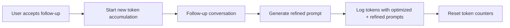

# Design Document

## Overview

The Follow-up questions feature extends the existing prompt optimization workflow by introducing an interactive refinement phase after the initial prompt improvement. This feature creates a new conversation flow that allows the LLM to ask clarifying questions to gather additional context and produce a more refined prompt.

The design integrates seamlessly with the existing bot architecture, leveraging the current state management, conversation management, and message handling systems while introducing new states and conversation flows.

## Architecture

### High-Level Flow



### State Management Integration

The feature introduces new states that integrate with the existing `StateManager` and `ConversationManager`:

- **Follow-up Offer State**: After sending improved prompt, waiting for ДА/НЕТ choice
- **Follow-up Conversation State**: During the question-answer session
- **Follow-up Generation State**: When user clicks generate button

## Components and Interfaces

### 1. State Manager Extensions

**New State Fields:**
```python
@dataclass
class UserState:
    waiting_for_prompt: bool = True
    last_interaction: Optional[str] = None
    # New fields for follow-up feature
    waiting_for_followup_choice: bool = False
    in_followup_conversation: bool = False
    improved_prompt_cache: Optional[str] = None  # Store improved prompt for follow-up
```

**New Methods:**
```python
def set_waiting_for_followup_choice(self, user_id: int, waiting: bool)
def set_in_followup_conversation(self, user_id: int, active: bool)
def set_improved_prompt_cache(self, user_id: int, prompt: str)
def get_improved_prompt_cache(self, user_id: int) -> Optional[str]
```

### 2. Conversation Manager Extensions

**New Methods:**
```python
def start_followup_conversation(self, user_id: int, improved_prompt: str)
    # Uses self.prompt_loader.followup_prompt to load system context
    # Uses cached improved prompt directly as user context
def is_in_followup_conversation(self, user_id: int) -> bool
def reset_to_followup_ready(self, user_id: int)
```

### 3. Message Handler Extensions

**New Message Constants:**
```python
# Follow-up offer message
FOLLOWUP_OFFER_MESSAGE = _(
    "Ваш промпт уже готов к использованию, но мы можем сделать его ещё лучше. Готовы ответить на несколько вопросов?",
    "Your prompt is ready to use, but we can make it even better. Ready to answer a few questions?"
)


# Button labels
BTN_YES = _("ДА", "YES")
BTN_NO = _("НЕТ", "NO") 
BTN_GENERATE_PROMPT = _("Сгенерировать промпт", "Generate Prompt")

# Keyboard layouts
FOLLOWUP_CHOICE_KEYBOARD = ReplyKeyboardMarkup(
    [[BTN_YES, BTN_NO]], resize_keyboard=True
)

FOLLOWUP_CONVERSATION_KEYBOARD = ReplyKeyboardMarkup(
    [[BTN_GENERATE_PROMPT], [BTN_RESET]], resize_keyboard=True
)
```


### 4. Bot Handler Extensions

**New Handler Methods:**
```python
async def _handle_followup_choice(self, update: Update, user_id: int, text: str)
async def _handle_followup_conversation(self, update: Update, user_id: int, text: str)
async def _process_followup_generation(self, update: Update, user_id: int)
```

**Modified Existing Methods:**
- `_process_with_llm()`: Add follow-up offer logic after improved prompt
- `handle_message()`: Add routing for follow-up states
- `reset_user_state()`: Reset new follow-up state fields

## Data Models

### Conversation Flow States

```python
class ConversationState(Enum):
    WAITING_FOR_PROMPT = "waiting_for_prompt"
    WAITING_FOR_METHOD = "waiting_for_method"
    IN_METHOD_CONVERSATION = "in_method_conversation"
    WAITING_FOR_FOLLOWUP_CHOICE = "waiting_for_followup_choice"        # New
    IN_FOLLOWUP_CONVERSATION = "in_followup_conversation"              # New
```

### Follow-up Response Parsing

The system needs to parse two types of responses from the follow-up LLM:
1. **Questions**: Regular conversation responses
2. **Refined Prompts**: Responses containing `<REFINED_PROMPT>` tags

**Enhanced Response Parser:**
```python
def parse_followup_response(response: str) -> tuple[str, bool]:
    """
    Parse follow-up LLM response to extract refined prompts.
    
    Returns:
        tuple: (parsed_content, is_refined_prompt)
    """
    # Check for refined prompt tags
    if "<REFINED_PROMPT>" in response.upper():
        # Extract content between tags
        # Remove opening and closing tags
        # Return cleaned prompt content
        pass
    
    # Regular question/conversation response
    return response, False
```

## Error Handling

### Follow-up Conversation Errors

1. **LLM Timeout/Failure**: Fall back to original improved prompt
2. **Invalid Response Format**: Request clarification from LLM
3. **User Abandonment**: Provide timeout mechanism to reset state
4. **Prompt Parsing Errors**: Use fallback parsing with partial content

### State Consistency

- **State Corruption**: Implement state validation and recovery
- **Conversation Desync**: Add conversation state verification
- **Memory Leaks**: Ensure proper cleanup of cached improved prompts

## Testing Strategy

### Unit Tests

1. **State Management Tests**
   - Test new state transitions
   - Verify state cleanup and reset
   - Test improved prompt caching

2. **Message Parsing Tests**
   - Test refined prompt tag extraction
   - Test various tag formats and edge cases
   - Test malformed response handling

3. **Conversation Flow Tests**
   - Test follow-up choice handling
   - Test conversation state transitions
   - Test button interaction logic

### Integration Tests

1. **End-to-End Flow Tests**
   - Complete follow-up conversation flow
   - User choice variations (ДА/НЕТ)
   - Generate button functionality
   - State reset after completion

2. **LLM Integration Tests**
   - Follow-up prompt loading
   - Response parsing accuracy
   - Error handling with LLM failures

### User Experience Tests

1. **Message Localization Tests**
   - Verify Russian/English message variants
   - Test button label localization
   - Validate message formatting

2. **Conversation Continuity Tests**
   - Test conversation history preservation
   - Verify proper context passing to LLM
   - Test conversation reset functionality

## Implementation Phases

### Phase 1: Core Infrastructure
- Extend StateManager with follow-up states
- Add new message constants and keyboards
- Implement basic follow-up choice handling

### Phase 2: Conversation Management
- Extend ConversationManager for follow-up flows
- Implement follow-up conversation initialization
- Add refined prompt parsing logic

### Phase 3: Bot Handler Integration
- Modify existing handlers for follow-up integration
- Implement new follow-up-specific handlers
- Add proper state routing logic

### Phase 4: Testing and Refinement
- Comprehensive testing of all flows
- Error handling improvements
- Performance optimization and cleanup

## Token Usage Tracking

### Token Accumulation Strategy

The follow-up questions feature implements a two-phase token tracking approach:

#### Phase 1: Initial Optimization


#### Phase 2: Follow-up Conversation (if user accepts)


### Implementation Details

**Token Session Management:**
```python
class TokenSession:
    def __init__(self):
        self.prompt_tokens = 0
        self.completion_tokens = 0
        self.total_tokens = 0
        self.start_prompt = None
        self.end_prompt = None
        self.method_name = None
    
    def log_to_sheets(self):
        # Log session data to Google Sheets
        pass
```

**Logging Strategy:**
1. **Initial Session**: Log when optimized prompt is generated
   ```python
   payload = {
       "BotID": self.config.bot_id or "UNKNOWN",
       "TelegramID": user_id,
       "LLM": f"{self.config.llm_backend}:{self.config.model_name}",
       "OptimizationModel": method_name,  # CRAFT, LYRA, GGL, etc.
       "UserRequest": initial_prompt,
       "Answer": optimized_prompt,
       "prompt_tokens": session_tokens.prompt_tokens,
       "completion_tokens": session_tokens.completion_tokens,
       "total_tokens": session_tokens.total_tokens
   }
   ```

2. **Follow-up Session**: Log when refined prompt is generated
   ```python
   payload = {
       "BotID": self.config.bot_id or "UNKNOWN",
       "TelegramID": user_id,
       "LLM": f"{self.config.llm_backend}:{self.config.model_name}",
       "OptimizationModel": "FOLLOWUP",
       "UserRequest": optimized_prompt,  # From Phase 1
       "Answer": refined_prompt,
       "prompt_tokens": followup_tokens.prompt_tokens,
       "completion_tokens": followup_tokens.completion_tokens,
       "total_tokens": followup_tokens.total_tokens
   }
   ```

**Key Design Decisions:**
- Each phase is logged separately to provide clear cost attribution
- Token counters are reset between phases to avoid double-counting
- Follow-up sessions are independent of initial optimization sessions
- No logging occurs if user declines follow-up questions

## Security Considerations

1. **Input Validation**: Validate all user inputs in follow-up conversations
2. **State Isolation**: Ensure user states don't interfere with each other
3. **Memory Management**: Prevent memory leaks from cached improved prompts
4. **Rate Limiting**: Apply existing rate limiting to follow-up conversations
5. **Content Filtering**: Apply same content filters to follow-up responses