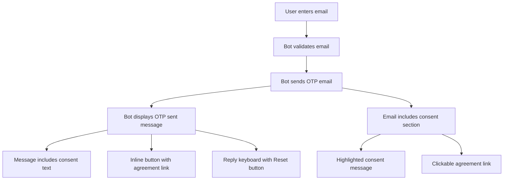

# Design Document: OTP Consent Agreement

## Overview

This design describes the implementation of personal data processing consent integration into the OTP authentication flow. The feature adds consent messaging and agreement links to both the Telegram bot interface and OTP email templates, ensuring users are informed about data processing before completing authentication.

## Architecture

The implementation follows the existing architecture patterns in the codebase:

1. **Messages Module** (`telegram_bot/utils/messages.py`): Contains all user-facing text with i18n support
2. **Email Templates Module** (`telegram_bot/utils/email_templates.py`): Contains email template generation with multilingual support
3. **Email Flow Module** (`telegram_bot/flows/email_flow.py`): Orchestrates the email authentication flow



## Components and Interfaces

### 1. Messages Module Updates

**New Constants:**

```python
# Consent message text
EMAIL_OTP_CONSENT_MESSAGE = _(
    "Вводя код подтверждения, вы даёте согласие на обработку персональных данных",
    "By entering the verification code, you consent to the processing of personal data"
)

# Agreement button text
BTN_DATA_AGREEMENT = _(
    "📄 Согласие на обработку персональных данных",
    "📄 Personal Data Processing Agreement"
)

# Agreement URL constant
DATA_AGREEMENT_URL = "https://disk.yandex.ru/i/zGiuY7mtIfOA-Q"

# Inline keyboard with agreement button
DATA_AGREEMENT_KEYBOARD = InlineKeyboardMarkup([
    [InlineKeyboardButton(BTN_DATA_AGREEMENT, url=DATA_AGREEMENT_URL)]
])
```

**Updated EMAIL_OTP_SENT Message:**

The existing `EMAIL_OTP_SENT` message will be updated to include the consent text:

```python
EMAIL_OTP_SENT = _(
    "📧 Код подтверждения отправлен на {email}.\n\n"
    "🔢 Введите 6-значный код из письма:\n\n"
    "Вводя код подтверждения, вы даёте согласие на обработку персональных данных",
    "📧 Verification code sent to {email}.\n\n"
    "🔢 Please enter the 6-digit code from the email:\n\n"
    "By entering the verification code, you consent to the processing of personal data"
)
```

### 2. Email Templates Module Updates

**New Method Parameters:**

The `get_otp_html_body` and `get_otp_plain_body` methods will be updated to include the consent section.

**HTML Email Structure:**

```html
<div class="consent-section">
    <p><strong>⚖️ {consent_message}</strong></p>
    <a href="{agreement_url}" class="agreement-button">{button_text}</a>
</div>
```

**CSS Styling for Consent Section:**

```css
.consent-section {
    background-color: #e3f2fd;
    border: 1px solid #90caf9;
    border-radius: 8px;
    padding: 15px;
    margin-bottom: 20px;
    text-align: center;
}
.agreement-button {
    display: inline-block;
    background-color: #1976d2;
    color: white;
    padding: 10px 20px;
    text-decoration: none;
    border-radius: 5px;
    margin-top: 10px;
}
```

### 3. Email Flow Module Updates

**Updated `handle_email_input` Method:**

The method will be updated to pass the inline keyboard when sending the OTP confirmation message:

```python
await self._safe_reply(
    update,
    EMAIL_OTP_SENT.format(email=mask_email(text.strip())),
    reply_markup=ReplyKeyboardMarkup([[BTN_RESET]], resize_keyboard=True),
)
```

**Note on Telegram API Limitation:**

Telegram API allows only one `reply_markup` per message. To display both the inline agreement button and the reply keyboard with Reset:
- The inline keyboard (agreement button) will be sent with the OTP message
- The reply keyboard (Reset button) is already persistent from previous messages and will remain visible

The implementation will use the inline keyboard for the agreement button since it provides a better UX for opening external URLs.

## Data Models

No new data models are required. The existing `AuthEvent` model already captures OTP verification events which serve as implicit consent records.

## Correctness Properties

*A property is a characteristic or behavior that should hold true across all valid executions of a system—essentially, a formal statement about what the system should do. Properties serve as the bridge between human-readable specifications and machine-verifiable correctness guarantees.*

### Property 1: OTP Message Contains Consent Text

*For any* language setting (Russian or English), the EMAIL_OTP_SENT message SHALL contain the corresponding consent message text.

**Validates: Requirements 1.1, 1.2, 1.3**

### Property 2: Agreement Button Has Correct URL

*For any* InlineKeyboardButton created for the data agreement, the button's URL property SHALL equal the Agreement_URL constant.

**Validates: Requirements 2.1, 2.4**

### Property 3: Email Consent Section Contains Required Elements

*For any* OTP email generated by the Email_Service, the email body SHALL contain:
- The consent message text matching the current language setting
- A clickable link/button with text matching the current language setting
- The link href pointing to the Agreement_URL

**Validates: Requirements 3.1, 3.2, 3.3, 3.4, 3.6, 3.7**

### Property 4: Language Consistency

*For any* language setting, the consent message text in Telegram and email SHALL use the same language, and the button/link text SHALL use the same language.

**Validates: Requirements 1.2, 1.3, 2.2, 2.3, 3.7**

## Error Handling

### Telegram Message Errors

- If the inline keyboard fails to attach, the message should still be sent with the consent text
- Existing error handling in `_safe_reply` method will catch and log any Telegram API errors

### Email Template Errors

- If email template generation fails, existing error handling will catch the exception
- The consent section uses static content, minimizing failure points

## Testing Strategy

### Unit Tests

Unit tests will verify:
1. `EMAIL_OTP_SENT` message contains consent text in both languages
2. `BTN_DATA_AGREEMENT` button text is correct in both languages
3. `DATA_AGREEMENT_URL` constant has the correct URL
4. `DATA_AGREEMENT_KEYBOARD` is properly constructed with correct URL
5. Email template `get_otp_html_body` includes consent section
6. Email template `get_otp_plain_body` includes consent section
7. Consent section appears before greeting in email

### Property-Based Tests

Property-based tests will use the `hypothesis` library (already used in the project) to verify:

1. **Property 1**: For any language setting, EMAIL_OTP_SENT contains the consent text
2. **Property 2**: Agreement button URL is always the correct constant
3. **Property 3**: Email templates always include consent section with correct elements
4. **Property 4**: Language consistency across Telegram and email messages

### Integration Tests

Integration tests will verify:
1. Email flow sends message with inline keyboard
2. OTP email is generated with consent section
3. Reset button remains functional alongside inline button
