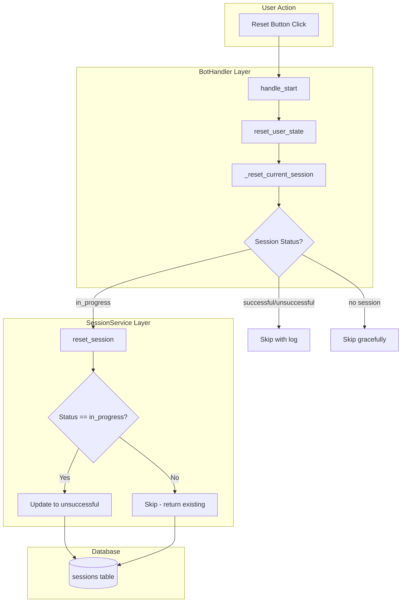

# Design Document: Session Status Protection

## Overview

This feature implements a "terminal state protection" pattern to prevent successfully completed sessions from being incorrectly overwritten to "unsuccessful" status. The fix uses a defense-in-depth approach with protection at two layers:

1. **SessionService layer**: The `reset_session()` method checks if the session is already in a terminal state before modifying it
2. **BotHandler layer**: The `_reset_current_session()` method checks session status before calling the service, providing clear logging and avoiding unnecessary database operations

This approach ensures that:
- Sessions marked "successful" remain successful even if user clicks reset
- Sessions marked "unsuccessful" remain unsuccessful
- Only "in_progress" sessions can be reset to "unsuccessful"
- Post-completion email tracking continues to work (session_id preserved in state)

## Architecture



### Component Interaction Flow

1. **User clicks Reset button** → `handle_message()` detects `BTN_RESET`
2. **handle_start() called** → Calls `reset_user_state(user_id)`
3. **reset_user_state() called** → Calls `_reset_current_session(user_id)` (unless `skip_session_reset=True`)
4. **_reset_current_session() - Layer 1 Protection**:
   - Gets session_id from state
   - If no session_id, skip gracefully
   - Gets session from database to check status
   - If status is terminal (successful/unsuccessful), log and skip
   - If status is in_progress, proceed to call `reset_session()`
5. **reset_session() - Layer 2 Protection**:
   - Gets session from database
   - If status is not in_progress, return existing session without modification
   - If status is in_progress, update to unsuccessful

## Components and Interfaces

### 1. SessionService.reset_session() (Modified)

Location: `telegram_bot/services/session_service.py`

```python
def reset_session(self, session_id: int) -> SessionModel | None:
    """
    Mark session as unsuccessful when user resets dialog.
    
    IMPORTANT: This method implements terminal state protection.
    Sessions that are already in a terminal state (successful or unsuccessful)
    will NOT be modified. Only sessions with status="in_progress" can be reset.
    
    Args:
        session_id: ID of the session to reset
        
    Returns:
        Session instance (existing if terminal, updated if was in_progress),
        or None on error (logged)
    """
    try:
        session = self._db_session.get(SessionModel, session_id)
        if session is None:
            logger.warning(f"Session {session_id} not found for reset")
            return None
        
        # Terminal state protection: don't overwrite completed sessions
        if session.status != SessionStatus.IN_PROGRESS.value:
            logger.debug(
                f"Session {session_id} already in terminal state '{session.status}', "
                "skipping reset"
            )
            return session  # Return existing session without modification
        
        # Session is in_progress, proceed with reset
        finish_time = datetime.now(UTC)
        session.status = SessionStatus.UNSUCCESSFUL.value
        session.finish_time = finish_time
        
        # Calculate duration
        if session.start_time is not None:
            duration = finish_time - session.start_time
            session.duration_seconds = int(duration.total_seconds())
        else:
            session.duration_seconds = 0
        
        self._db_session.commit()
        self._db_session.refresh(session)
        logger.info(
            f"Reset session {session_id} as unsuccessful "
            f"(duration: {session.duration_seconds}s)"
        )
        return session
        
    except Exception as e:
        logger.error(f"Failed to reset session {session_id}: {e}")
        self._db_session.rollback()
        return None
```

### 2. SessionService.get_session() (New Method)

Location: `telegram_bot/services/session_service.py`

```python
def get_session(self, session_id: int) -> SessionModel | None:
    """
    Get a session by ID.
    
    Args:
        session_id: ID of the session to retrieve
        
    Returns:
        Session instance, or None if not found or on error (logged)
    """
    try:
        session = self._db_session.get(SessionModel, session_id)
        if session is None:
            logger.debug(f"Session {session_id} not found")
            return None
        return session
    except Exception as e:
        logger.error(f"Failed to get session {session_id}: {e}")
        return None
```

### 3. BotHandler._reset_current_session() (Modified)

Location: `telegram_bot/core/bot_handler.py`

```python
def _reset_current_session(self, telegram_user_id: int):
    """
    Reset the current session as unsuccessful when user resets dialog.
    
    This method implements Layer 1 of terminal state protection.
    It checks if the session is already in a terminal state before
    calling the SessionService, providing clear logging and avoiding
    unnecessary operations.
    
    Args:
        telegram_user_id: Telegram user ID
        
    Requirements: 3.1
    """
    try:
        # Check if session service is available
        if not self.session_service:
            logger.debug(
                f"session_reset_skipped | user_id={telegram_user_id} | "
                "reason=session_service_not_available"
            )
            return
        
        # Get current session ID from state
        session_id = self.state_manager.get_current_session_id(telegram_user_id)
        if session_id is None:
            logger.debug(
                f"session_reset_skipped | user_id={telegram_user_id} | "
                "reason=no_active_session"
            )
            return
        
        # Layer 1 Protection: Check session status before reset
        session = self.session_service.get_session(session_id)
        if session is None:
            logger.warning(
                f"session_reset_skipped | user_id={telegram_user_id} | "
                f"session_id={session_id} | reason=session_not_found"
            )
            return
        
        # Skip reset if session is already in terminal state
        if session.status != "in_progress":
            logger.info(
                f"session_reset_skipped | user_id={telegram_user_id} | "
                f"session_id={session_id} | status={session.status} | "
                "reason=already_terminal_state"
            )
            return
        
        # Session is in_progress, proceed with reset
        result = self.session_service.reset_session(session_id)
        
        if result:
            logger.info(
                f"session_reset | telegram_user_id={telegram_user_id} | "
                f"session_id={session_id} | status=unsuccessful | "
                f"duration={result.duration_seconds}s | "
                f"tokens={result.tokens_total}"
            )
        else:
            logger.warning(
                f"session_reset_failed | telegram_user_id={telegram_user_id} | "
                f"session_id={session_id} | continuing_without_reset"
            )
            
    except Exception as e:
        # Graceful degradation - session tracking failure should not block user
        logger.error(
            f"session_reset_error | telegram_user_id={telegram_user_id} | error={e}",
            exc_info=True,
        )
```

## Data Models

No changes to data models are required. The existing `sessions` table schema supports this feature:

| Column | Type | Relevant for this feature |
|--------|------|---------------------------|
| status | TEXT | Used to check terminal state (successful/unsuccessful vs in_progress) |

## Correctness Properties

*A property is a characteristic or behavior that should hold true across all valid executions of a system.*

### Property 1: Terminal state immutability
*For any* session with status "successful" or "unsuccessful", calling `reset_session()` SHALL NOT modify the session's status, finish_time, or duration_seconds fields.
**Validates: Requirements 1.1, 1.2, 1.5**

### Property 2: In-progress sessions can be reset
*For any* session with status "in_progress", calling `reset_session()` SHALL update the status to "unsuccessful" and set finish_time and duration_seconds.
**Validates: Requirements 1.3**

### Property 3: Reset returns session object
*For any* call to `reset_session()` on an existing session, the method SHALL return the session object (either existing unchanged or updated), never None for valid session IDs.
**Validates: Requirements 1.5**

### Property 4: Graceful degradation on errors
*For any* database error during session status check or reset, the system SHALL log the error and allow the user's reset action to proceed without displaying errors.
**Validates: Requirements 4.1, 4.2**

## Error Handling

### Design Principle: Graceful Degradation (Inherited)

Session status protection inherits the graceful degradation principle from the existing session tracking system. All operations:
1. Log errors with full context
2. Return None or continue execution on errors
3. Never block the user's reset action

### Error Scenarios

| Scenario | Handling | User Impact |
|----------|----------|-------------|
| Database error getting session | Log error, skip reset | None - reset proceeds |
| Database error updating session | Log error, return None | None - reset proceeds |
| Session not found | Log warning, skip reset | None - reset proceeds |
| Session service unavailable | Log debug, skip reset | None - reset proceeds |

## Testing Strategy

### Unit Tests

1. **SessionService.reset_session() tests**:
   - Test reset on "in_progress" session → status changes to "unsuccessful"
   - Test reset on "successful" session → status unchanged
   - Test reset on "unsuccessful" session → status unchanged
   - Test reset on non-existent session → returns None

2. **SessionService.get_session() tests**:
   - Test get existing session → returns session
   - Test get non-existent session → returns None

3. **BotHandler._reset_current_session() tests**:
   - Test with no session_id in state → skips gracefully
   - Test with "in_progress" session → calls reset_session
   - Test with "successful" session → skips with log
   - Test with "unsuccessful" session → skips with log

### Property-Based Tests

The implementation will use `hypothesis` for property-based testing.

```python
# **Feature: session-status-protection, Property 1: Terminal state immutability**
# **Validates: Requirements 1.1, 1.2, 1.5**
@given(
    status=st.sampled_from(["successful", "unsuccessful"]),
    tokens=st.integers(min_value=0, max_value=10000)
)
def test_terminal_state_immutability(status, tokens):
    # Create session with terminal status
    # Call reset_session
    # Assert status unchanged
```

### Integration Tests

1. **Full reset flow with successful session**:
   - Create session → complete session → click reset → verify status still "successful"

2. **Full reset flow with in-progress session**:
   - Create session → click reset → verify status is "unsuccessful"

3. **Email flow protection**:
   - Start email flow → send email successfully → click reset → verify status still "successful"
