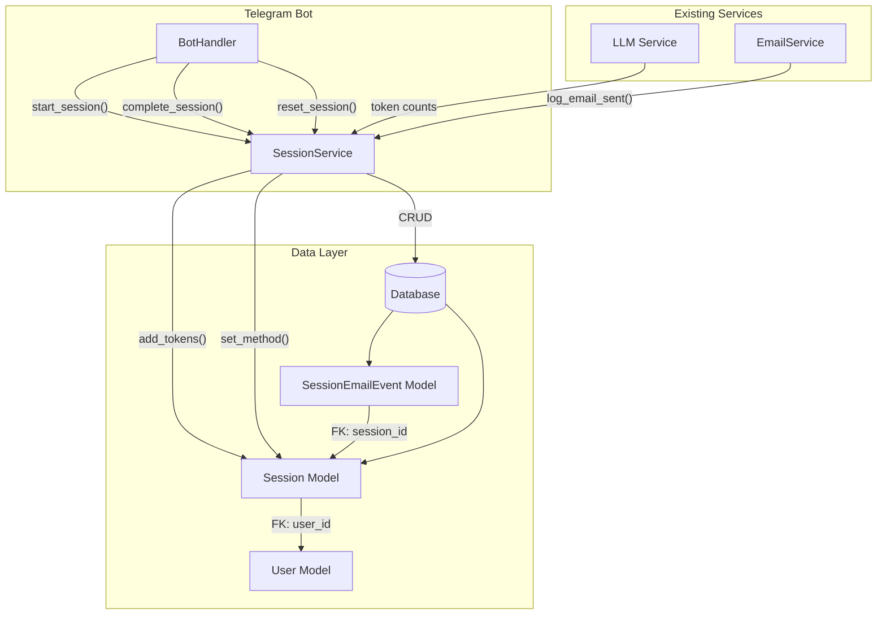

# Design Document: Session Tracking

## Overview

This feature introduces a Session entity to track prompt optimization workflows from start to finish. The system captures:

1. **Session Lifecycle**: Creation on prompt submission (before method selection), completion on delivery, termination on reset/timeout
2. **Token Metrics**: Cumulative input/output token counts for both initial optimization and followup phases (tracked separately)
3. **Optimization Method**: Primary method (LYRA/CRAFT/GGL) - nullable initially, updated when user selects method
4. **Followup Tracking**: Separate timing and token metrics for followup conversations, with messages in same conversation history
5. **Email Events**: Detailed records of emails sent per session (can be recorded even after session is marked successful)
6. **Timing**: Start time, finish time, duration for both main session and followup phase
7. **Conversation History**: Complete record of all user-LLM message exchanges (including both initial and followup phases)

The implementation adds two new database tables (`sessions` and `session_email_events`) and a `SessionService` to manage session lifecycle. Conversation history is stored as JSONB within the sessions table for simplicity and atomic updates.

**Key Design Decisions:**
- Session is created immediately when user sends initial prompt (not when method is selected)
- Session ID remains in state after session is marked "successful" to allow post-completion tracking
- Session ID is cleared only on reset button click or when user sends a new initial prompt
- Followup is tracked on the same session (not a new session) with separate metrics
- Email events can be logged on any session regardless of status

## Architecture



### Component Interaction Flow

1. **Session Start**: When user submits a prompt (in `_handle_prompt_input`), `BotHandler` calls `SessionService.start_session(user_id, model_name)` which creates a new session record with `optimization_method=NULL`. The initial prompt is immediately tracked in conversation history.
2. **Method Selection**: When user selects optimization method, `SessionService.set_optimization_method(session_id, method)` updates the session
3. **Token Accumulation (Initial)**: After each LLM call during initial optimization, `SessionService.add_tokens(session_id, input_tokens, output_tokens)` accumulates token counts
4. **Session Completion**: When improved prompt is delivered, `SessionService.complete_session(session_id)` marks it successful. **Note: session_id is NOT cleared from state at this point.**
5. **FOLLOWUP Start**: When user opts for followup, `SessionService.start_followup(session_id)` sets `used_followup=True` and `followup_start_time`
6. **Token Accumulation (Followup)**: After each LLM call during followup, `SessionService.add_followup_tokens(session_id, input_tokens, output_tokens)` accumulates followup token counts separately
7. **FOLLOWUP Completion**: When followup conversation completes, `SessionService.complete_followup(session_id)` sets `followup_finish_time` and calculates duration
8. **Email Logging**: When email is sent, `SessionService.log_email_sent(session_id, email, status)` creates an email event record (works on any session regardless of status)
9. **Session Reset**: When user resets dialog, `SessionService.reset_session(session_id)` marks it unsuccessful and clears session_id from state
10. **New Prompt**: When user sends a new initial prompt, the previous session_id is cleared from state before creating a new session
11. **Timeout Check**: Background task calls `SessionService.timeout_stale_sessions()` to close inactive sessions

## Components and Interfaces

### 1. SessionService (New)

Location: `telegram_bot/services/session_service.py`

```python
class SessionStatus(str, Enum):
    IN_PROGRESS = "in_progress"
    SUCCESSFUL = "successful"
    UNSUCCESSFUL = "unsuccessful"

class OptimizationMethod(str, Enum):
    LYRA = "LYRA"
    CRAFT = "CRAFT"
    GGL = "GGL"

class SessionService:
    """Service for managing prompt optimization sessions."""
    
    def start_session(
        self, 
        user_id: int, 
        model_name: str,
        method: OptimizationMethod | None = None
    ) -> Session | None:
        """
        Start a new optimization session.
        
        Args:
            user_id: Foreign key to users.id
            model_name: LLM model identifier (e.g., "openai/gpt-4")
            method: Selected optimization method (optional, can be set later)
            
        Returns:
            Created Session instance, or None on error (logged)
        """
        
    def set_optimization_method(
        self, 
        session_id: int, 
        method: OptimizationMethod
    ) -> Session | None:
        """
        Set the optimization method for a session.
        
        Called when user selects method after session is created.
        Returns None on error (logged).
        """
        
    def complete_session(self, session_id: int) -> Session | None:
        """
        Mark session as successful when improved prompt is delivered.
        
        Sets status to SUCCESSFUL, finish_time to now, calculates duration.
        NOTE: Does NOT clear session_id from state - allows post-completion tracking.
        Returns None on error (logged).
        """
        
    def reset_session(self, session_id: int) -> Session | None:
        """
        Mark session as unsuccessful when user resets dialog.
        
        Sets status to UNSUCCESSFUL, finish_time to now, preserves metrics.
        Returns None on error (logged).
        """
        
    def add_tokens(
        self, 
        session_id: int, 
        input_tokens: int, 
        output_tokens: int
    ) -> Session | None:
        """
        Add token counts from an LLM interaction (initial optimization phase).
        
        Accumulates to existing counts, recalculates total.
        Returns None on error (logged).
        """
        
    def start_followup(self, session_id: int) -> Session | None:
        """
        Start followup conversation tracking.
        
        Sets used_followup=True and followup_start_time to now.
        Returns None on error (logged).
        """
        
    def complete_followup(self, session_id: int) -> Session | None:
        """
        Complete followup conversation tracking.
        
        Sets followup_finish_time to now and calculates followup_duration_seconds.
        Returns None on error (logged).
        """
        
    def add_followup_tokens(
        self, 
        session_id: int, 
        input_tokens: int, 
        output_tokens: int
    ) -> Session | None:
        """
        Add token counts from an LLM interaction (followup phase).
        
        Accumulates to followup token counts, recalculates followup total.
        Returns None on error (logged).
        """
        
    def log_email_sent(
        self, 
        session_id: int, 
        recipient_email: str, 
        status: str
    ) -> SessionEmailEvent | None:
        """
        Log an email delivery event for the session.
        
        Creates a SessionEmailEvent record linked to the session.
        Works on any session regardless of status (including "successful").
        Returns None on error (logged).
        """
        
    def add_message(
        self,
        session_id: int,
        role: str,
        content: str
    ) -> Session | None:
        """
        Add a message to the session's conversation history (JSONB).
        
        Used for both initial optimization and followup messages.
        
        Args:
            session_id: Session to add message to
            role: "user" or "assistant"
            content: Message content
            
        Returns:
            Updated Session instance, or None on error (logged)
        """
        
    def timeout_stale_sessions(self, timeout_seconds: int) -> int:
        """
        Mark all sessions inactive for longer than timeout as unsuccessful.
        
        Args:
            timeout_seconds: Inactivity threshold in seconds
            
        Returns:
            Number of sessions timed out
        """
        
    def get_user_current_session(self, user_id: int) -> Session | None:
        """Get the current in-progress session for a user, if any."""
        
    def get_session_with_emails(self, session_id: int) -> Session:
        """Get session with all associated email events loaded."""
        
    def get_conversation_history(self, session_id: int) -> list[dict]:
        """Get all messages for a session in chronological order from JSONB field."""
```

### 2. Session Model (New)

Location: `telegram_bot/data/database.py`

```python
class Session(Base):
    __tablename__ = "sessions"

    id: Mapped[int] = mapped_column(primary_key=True)  # Auto-increment
    user_id: Mapped[int] = mapped_column(ForeignKey("users.id"), nullable=False)
    
    # Timing (main session)
    start_time: Mapped[datetime] = mapped_column(DateTime(timezone=True), default=func.now())
    finish_time: Mapped[datetime | None] = mapped_column(DateTime(timezone=True))
    duration_seconds: Mapped[int | None] = mapped_column(Integer)
    
    # Status
    status: Mapped[str] = mapped_column(Text, default="in_progress")  # in_progress, successful, unsuccessful
    
    # Optimization method and model
    optimization_method: Mapped[str | None] = mapped_column(Text, nullable=True)  # LYRA, CRAFT, GGL - nullable until user selects
    model_name: Mapped[str] = mapped_column(Text, nullable=False)  # e.g., "openai/gpt-4", "gpt-4o"
    used_followup: Mapped[bool] = mapped_column(Boolean, default=False)
    
    # Token metrics (initial optimization phase)
    input_tokens: Mapped[int] = mapped_column(Integer, default=0)
    output_tokens: Mapped[int] = mapped_column(Integer, default=0)
    tokens_total: Mapped[int] = mapped_column(Integer, default=0)
    
    # Followup timing
    followup_start_time: Mapped[datetime | None] = mapped_column(DateTime(timezone=True))
    followup_finish_time: Mapped[datetime | None] = mapped_column(DateTime(timezone=True))
    followup_duration_seconds: Mapped[int | None] = mapped_column(Integer)
    
    # Followup token metrics
    followup_input_tokens: Mapped[int] = mapped_column(Integer, default=0)
    followup_output_tokens: Mapped[int] = mapped_column(Integer, default=0)
    followup_tokens_total: Mapped[int] = mapped_column(Integer, default=0)
    
    # Conversation history as JSONB (includes both initial and followup messages)
    # Format: [{"role": "user"|"assistant", "content": "...", "timestamp": "ISO8601"}, ...]
    conversation_history: Mapped[list] = mapped_column(JSONB, default=list)
    
    # Relationships
    user: Mapped["User"] = relationship("User", back_populates="sessions")
    email_events: Mapped[list["SessionEmailEvent"]] = relationship(
        "SessionEmailEvent", back_populates="session", cascade="all, delete-orphan"
    )
```

### 3. SessionEmailEvent Model (New)

Location: `telegram_bot/data/database.py`

```python
class SessionEmailEvent(Base):
    __tablename__ = "session_email_events"

    id: Mapped[int] = mapped_column(primary_key=True)
    session_id: Mapped[int] = mapped_column(ForeignKey("sessions.id"), nullable=False)
    
    sent_at: Mapped[datetime] = mapped_column(DateTime(timezone=True), default=func.now())
    recipient_email: Mapped[str] = mapped_column(Text, nullable=False)
    delivery_status: Mapped[str] = mapped_column(Text, nullable=False)  # sent, failed
    
    # Relationship
    session: Mapped["Session"] = relationship("Session", back_populates="email_events")
```

### 4. User Model Updates

Location: `telegram_bot/data/database.py`

Add relationship to sessions:

```python
class User(Base):
    # ... existing fields ...
    
    # NEW: Relationship to sessions
    sessions: Mapped[list["Session"]] = relationship("Session", back_populates="user")
```

### 5. Configuration Updates

Location: `telegram_bot/utils/config.py`

```python
@dataclass
class BotConfig:
    # ... existing fields ...
    
    # Session settings
    session_timeout_seconds: int = 86400  # 24 hours default
```

## Data Models

### Session Table Schema

| Column | Type | Constraints | Description |
|--------|------|-------------|-------------|
| id | INTEGER | PRIMARY KEY, AUTO INCREMENT | Unique session identifier |
| user_id | INTEGER | FOREIGN KEY (users.id), NOT NULL | Reference to user |
| start_time | TIMESTAMP WITH TZ | NOT NULL, DEFAULT NOW() | Session start timestamp |
| finish_time | TIMESTAMP WITH TZ | NULLABLE | Session end timestamp |
| duration_seconds | INTEGER | NULLABLE | Calculated duration |
| status | TEXT | NOT NULL, DEFAULT 'in_progress' | Session status |
| optimization_method | TEXT | NULLABLE | LYRA, CRAFT, or GGL (NULL until user selects) |
| model_name | TEXT | NOT NULL | LLM model identifier |
| used_followup | BOOLEAN | NOT NULL, DEFAULT FALSE | Whether FOLLOWUP was used |
| input_tokens | INTEGER | NOT NULL, DEFAULT 0 | Cumulative input tokens (initial phase) |
| output_tokens | INTEGER | NOT NULL, DEFAULT 0 | Cumulative output tokens (initial phase) |
| tokens_total | INTEGER | NOT NULL, DEFAULT 0 | Sum of input + output (initial phase) |
| followup_start_time | TIMESTAMP WITH TZ | NULLABLE | Followup conversation start timestamp |
| followup_finish_time | TIMESTAMP WITH TZ | NULLABLE | Followup conversation end timestamp |
| followup_duration_seconds | INTEGER | NULLABLE | Calculated followup duration |
| followup_input_tokens | INTEGER | NOT NULL, DEFAULT 0 | Cumulative input tokens (followup phase) |
| followup_output_tokens | INTEGER | NOT NULL, DEFAULT 0 | Cumulative output tokens (followup phase) |
| followup_tokens_total | INTEGER | NOT NULL, DEFAULT 0 | Sum of followup input + output |
| conversation_history | JSONB | NOT NULL, DEFAULT '[]' | Array of message objects (both phases) |

### Conversation History JSONB Structure

```json
[
  {
    "role": "user",
    "content": "Original prompt text...",
    "timestamp": "2025-12-16T10:00:00Z"
  },
  {
    "role": "assistant", 
    "content": "Improved prompt or clarifying question...",
    "timestamp": "2025-12-16T10:00:05Z"
  },
  {
    "role": "user",
    "content": "Follow-up answer...",
    "timestamp": "2025-12-16T10:01:00Z"
  }
]
```

### SessionEmailEvent Table Schema

| Column | Type | Constraints | Description |
|--------|------|-------------|-------------|
| id | INTEGER | PRIMARY KEY, AUTO INCREMENT | Unique event identifier |
| session_id | INTEGER | FOREIGN KEY (sessions.id), NOT NULL | Reference to session |
| sent_at | TIMESTAMP WITH TZ | NOT NULL, DEFAULT NOW() | Email send timestamp |
| recipient_email | TEXT | NOT NULL | Recipient email address |
| delivery_status | TEXT | NOT NULL | sent or failed |

### Database Indexes

```python
# Session indexes
Index("ix_sessions_user_id", Session.user_id)
Index("ix_sessions_status", Session.status)
Index("ix_sessions_start_time", Session.start_time)
Index("ix_sessions_user_status", Session.user_id, Session.status)  # Composite for current session lookup

# SessionEmailEvent indexes
Index("ix_session_email_events_session_id", SessionEmailEvent.session_id)
```

## Correctness Properties

*A property is a characteristic or behavior that should hold true across all valid executions of a system-essentially, a formal statement about what the system should do. Properties serve as the bridge between human-readable specifications and machine-verifiable correctness guarantees.*

### Property 1: New sessions initialize with correct defaults
*For any* new session created via `start_session()`, the session SHALL have `status="in_progress"`, `used_followup=False`, `input_tokens=0`, `output_tokens=0`, `tokens_total=0`, and `start_time` set to a timezone-aware UTC timestamp.
**Validates: Requirements 1.3, 1.4, 5.1, 6.3**

### Property 2: Session user reference integrity
*For any* session created via `start_session(user_id)`, the `user_id` SHALL reference a valid existing user in the `users` table.
**Validates: Requirements 1.2**

### Property 3: Token accumulation is additive
*For any* session and any sequence of `add_tokens(input, output)` calls, the final `input_tokens` SHALL equal the sum of all input values, `output_tokens` SHALL equal the sum of all output values, and `tokens_total` SHALL equal `input_tokens + output_tokens`.
**Validates: Requirements 5.2, 5.3, 5.4, 5.5**

### Property 4: Successful completion sets finish time and duration
*For any* session marked successful via `complete_session()`, the `finish_time` SHALL be set to a timestamp >= `start_time`, and `duration_seconds` SHALL equal `(finish_time - start_time).total_seconds()`.
**Validates: Requirements 2.1, 2.2, 2.3**

### Property 5: Reset preserves metrics
*For any* session with recorded tokens and method, calling `reset_session()` SHALL change status to "unsuccessful" and set `finish_time`, but SHALL NOT modify `input_tokens`, `output_tokens`, `tokens_total`, `optimization_method`, or `used_followup`.
**Validates: Requirements 3.1, 3.2, 3.3**

### Property 6: Email events are linked to sessions
*For any* email event created via `log_email_sent(session_id, ...)`, the event SHALL have a valid `session_id` reference, and querying the session SHALL include this event in `email_events`.
**Validates: Requirements 7.1, 7.3**

### Property 7: Session serialization round-trip
*For any* valid session object (including conversation history), serializing to JSON and parsing back SHALL produce an equivalent session object with all fields preserved.
**Validates: Requirements 11.1, 11.2, 11.3**

### Property 8: Timeout marks sessions unsuccessful
*For any* session with `status="in_progress"` and `start_time` older than the configured timeout (in seconds), calling `timeout_stale_sessions()` SHALL change its status to "unsuccessful" and set `finish_time`.
**Validates: Requirements 4.1, 4.2**

### Property 9: One active session per user
*For any* user, there SHALL be at most one session with `status="in_progress"` at any time.
**Validates: Requirements 1.1** (implicit - new session implies previous is closed)

### Property 10: Conversation history preserves message order
*For any* session, messages added via `add_message()` SHALL be appended to the `conversation_history` JSONB array in the order they were added, preserving chronological order of user-LLM exchanges.
**Validates: Requirements 10.1, 10.2, 10.3, 10.4**

## Error Handling

### Design Principle: Graceful Degradation

Session tracking is **analytics/telemetry**, not core business logic. The user's primary goal is prompt optimization - they should never be blocked because session tracking failed. All session operations follow the "log and proceed" pattern.

### Database Errors During Session Operations

When a database error occurs during session operations:
1. Log the error with full context (session_id, user_id, operation, error details)
2. Return `None` or a safe default value
3. Allow the bot to continue processing the user's request normally
4. The user experience is never degraded due to session tracking failures

| Operation | Return on Error | Rationale |
|-----------|-----------------|-----------|
| `start_session()` | `None` | User can still optimize prompts |
| `add_tokens()` | `None` | Token counting is analytics only |
| `add_message()` | `None` | Conversation logging is analytics only |
| `complete_session()` | `None` | User already got their result |
| `reset_session()` | `None` | Reset should always work for user |
| `set_followup_used()` | `None` | Flag is analytics only |
| `log_email_sent()` | `None` | Email was already sent |
| `get_user_current_session()` | `None` | Treat as "no session" if DB fails |

```python
def add_tokens(self, session_id: int, input_tokens: int, output_tokens: int) -> Session | None:
    try:
        # ... token update logic
        return session
    except Exception as e:
        logger.error(f"Failed to add tokens to session {session_id}: {e}")
        return None  # Graceful degradation - don't block user

def start_session(self, user_id: int, method: OptimizationMethod, model_name: str) -> Session | None:
    try:
        # ... session creation logic
        return session
    except Exception as e:
        logger.error(f"Failed to start session for user {user_id}: {e}")
        return None  # User can still use the bot
```

### Timeout Job Errors

The timeout background task should:
1. Process sessions in batches to avoid long transactions
2. Log each timeout operation
3. Continue processing remaining sessions if one fails
4. Report total successes and failures

### Migration Rollback

The migration includes a complete `downgrade()` function that:
1. Drops the `session_email_events` table (child first due to FK)
2. Drops the `sessions` table (includes conversation_history JSONB)
3. Removes the relationship from User model

## Testing Strategy

### Unit Tests

1. **SessionService tests**:
   - Test `start_session()` creates session with correct defaults
   - Test `complete_session()` sets status, finish_time, duration
   - Test `reset_session()` preserves metrics
   - Test `add_tokens()` accumulates correctly
   - Test `log_email_sent()` creates linked event
   - Test `timeout_stale_sessions()` marks old sessions

2. **Model tests**:
   - Test Session fields have correct defaults
   - Test foreign key constraint to users
   - Test SessionEmailEvent links to session
   - Test conversation_history JSONB operations (append, retrieve)

### Property-Based Tests

The implementation will use `hypothesis` for property-based testing.

Each property-based test will:
- Generate random valid inputs (user_ids, token counts, methods)
- Execute the operation under test
- Verify the correctness property holds

Test annotations will follow the format:
```python
# **Feature: session-tracking, Property 3: Token accumulation is additive**
# **Validates: Requirements 5.2, 5.3, 5.4, 5.5**
```

### Integration Tests

1. Test full session lifecycle: start -> add tokens -> complete
2. Test session with FOLLOWUP: start -> add tokens -> set followup -> add more tokens -> complete
3. Test session with email: start -> complete -> log email
4. Test timeout: create old session -> run timeout -> verify status
