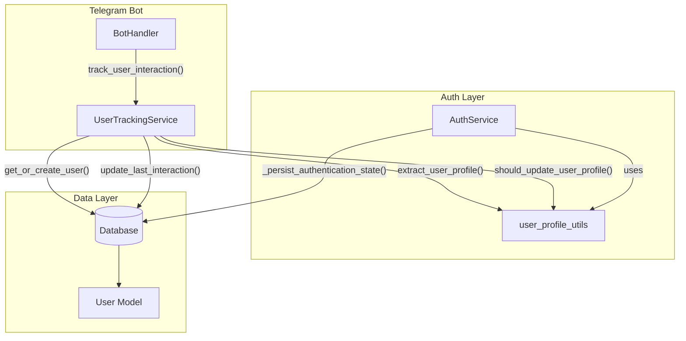

# Design Document: User Activity Tracking

## Overview

This feature extends the existing user management system to track user activity timestamps and modify the user lifecycle. The key changes are:

1. **Early User Creation**: Users are created in the database on their first bot interaction (before email verification), rather than only when they verify their email
2. **Activity Tracking**: Two new timestamp fields (`first_interaction_at` and `last_interaction_at`) track when users first and last interacted with the bot
3. **Schema Changes**: The `email` column is modified to allow null values for unauthenticated users

The implementation leverages existing functionality in `AuthService` and `user_profile_utils.py` to maintain consistency with current patterns.

## Architecture



### Component Interaction Flow

1. **First Interaction**: When a user sends their first message, `BotHandler` calls `UserTrackingService.track_user_interaction()`, which creates a new user record with `email=null` and `is_authenticated=false`
2. **Subsequent Interactions**: For returning users, `track_user_interaction()` updates `last_interaction_at` and optionally updates profile data if changes are detected
3. **Email Verification**: When a user verifies their email, `AuthService._persist_authentication_state()` updates the existing user record (found by `telegram_id`) with the email and authentication status

## Components and Interfaces

### 1. UserTrackingService (New)

Location: `telegram_bot/services/user_tracking.py`

```python
class UserTrackingService:
    """Service for tracking user interactions and managing user lifecycle."""
    
    def track_user_interaction(
        self, 
        telegram_id: int, 
        effective_user: Any | None
    ) -> tuple[User, bool]:
        """
        Track a user interaction, creating or updating the user record.
        
        Args:
            telegram_id: User's Telegram ID
            effective_user: Telegram User object for profile extraction
            
        Returns:
            Tuple of (User instance, is_first_time_user)
        """
        
    def get_or_create_user(
        self, 
        telegram_id: int, 
        effective_user: Any | None
    ) -> tuple[User, bool]:
        """
        Get existing user or create new one.
        
        Returns:
            Tuple of (User instance, was_created)
        """
        
    def is_first_time_user(self, user: User) -> bool:
        """
        Check if user is interacting for the first time.
        
        Returns:
            True if first_interaction_at equals last_interaction_at
        """
```

### 2. User Model Updates

Location: `telegram_bot/data/database.py`

New fields added to the `User` class:
- `first_interaction_at: Mapped[datetime]` - Set once on user creation
- `last_interaction_at: Mapped[datetime]` - Updated on every interaction

Modified fields:
- `email: Mapped[str | None]` - Changed from `Mapped[str]` to allow null

### 3. AuthService Updates

Location: `telegram_bot/auth/auth_service.py`

The `_persist_authentication_state()` method is updated to:
- Look up existing users by `telegram_id` (already does this)
- Preserve `first_interaction_at` and `created_at` when updating
- Handle the case where user already exists (created on first interaction)

### 4. BotHandler Integration

Location: `telegram_bot/core/bot_handler.py`

The `handle_message()` method is updated to call `UserTrackingService.track_user_interaction()` early in the message processing flow.

## Data Models

### User Model (Updated)

```python
class User(Base):
    __tablename__ = "users"

    # Existing fields
    id: Mapped[int] = mapped_column(primary_key=True)
    telegram_id: Mapped[int] = mapped_column(BigInteger, unique=True, nullable=False)
    email: Mapped[str | None] = mapped_column(Text, unique=True, nullable=True)  # CHANGED: nullable=True
    email_original: Mapped[str | None] = mapped_column(Text)
    is_authenticated: Mapped[bool] = mapped_column(Boolean, default=False)
    email_verified_at: Mapped[datetime | None] = mapped_column(DateTime(timezone=True))
    last_authenticated_at: Mapped[datetime | None] = mapped_column(DateTime(timezone=True))
    created_at: Mapped[datetime] = mapped_column(DateTime(timezone=True), default=func.now())
    updated_at: Mapped[datetime] = mapped_column(DateTime(timezone=True), default=func.now(), onupdate=func.now())
    
    # Existing profile fields
    first_name: Mapped[str | None] = mapped_column(Text)
    last_name: Mapped[str | None] = mapped_column(Text)
    is_bot: Mapped[bool] = mapped_column(Boolean, default=False)
    is_premium: Mapped[bool | None] = mapped_column(Boolean)
    language_code: Mapped[str | None] = mapped_column(Text)
    
    # NEW: Activity tracking fields
    first_interaction_at: Mapped[datetime] = mapped_column(DateTime(timezone=True), default=func.now())
    last_interaction_at: Mapped[datetime] = mapped_column(DateTime(timezone=True), default=func.now())
```

### Database Migration

New migration file: `alembic/versions/003_add_activity_tracking_fields.py`

Changes:
1. Add `first_interaction_at` column (nullable initially for existing data)
2. Add `last_interaction_at` column (nullable initially for existing data)
3. Backfill existing records with `created_at` value for both fields
4. Create indexes on both columns
5. Modify `email` column to allow null values
6. Handle unique constraint on `email` for null values

## Correctness Properties

*A property is a characteristic or behavior that should hold true across all valid executions of a system-essentially, a formal statement about what the system should do. Properties serve as the bridge between human-readable specifications and machine-verifiable correctness guarantees.*

### Property 1: New user creation sets both timestamps equally
*For any* new user created via `track_user_interaction()`, the `first_interaction_at` and `last_interaction_at` fields SHALL be equal and set to the current UTC time.
**Validates: Requirements 2.1, 3.1, 4.1**

### Property 2: First interaction timestamp is immutable
*For any* existing user, subsequent calls to `track_user_interaction()` SHALL NOT modify the `first_interaction_at` value.
**Validates: Requirements 2.2, 5.3**

### Property 3: Last interaction timestamp updates on each interaction
*For any* existing user, calling `track_user_interaction()` SHALL update `last_interaction_at` to a value greater than or equal to the previous value.
**Validates: Requirements 3.2, 7.1**

### Property 4: First-time user identification
*For any* user where `first_interaction_at` equals `last_interaction_at`, the `is_first_time_user()` method SHALL return `True`. *For any* user where `last_interaction_at` is later than `first_interaction_at`, the method SHALL return `False`.
**Validates: Requirements 4.1, 4.2, 4.3**

### Property 5: No duplicate users created
*For any* `telegram_id`, calling `track_user_interaction()` multiple times SHALL result in exactly one user record in the database.
**Validates: Requirements 1.3**

### Property 6: Unauthenticated users have null email
*For any* user created via `track_user_interaction()` (before email verification), the `email` field SHALL be `null` and `is_authenticated` SHALL be `false`.
**Validates: Requirements 1.2, 8.1**

### Property 7: Email verification preserves activity history
*For any* user who verifies their email, the `first_interaction_at` and `created_at` values SHALL remain unchanged after verification.
**Validates: Requirements 5.3**

### Property 8: Timestamps are timezone-aware UTC
*For any* user record, the `first_interaction_at` and `last_interaction_at` fields SHALL be timezone-aware datetime values in UTC.
**Validates: Requirements 2.3, 3.3, 7.2**

### Property 9: Multiple null emails allowed
*For any* number of unauthenticated users, the database SHALL allow multiple records with `email = null`.
**Validates: Requirements 8.2**

## Error Handling

### Database Errors During Activity Tracking

When a database error occurs during `track_user_interaction()`:
1. Log the error with full context (telegram_id, error details)
2. Return gracefully without raising an exception
3. Allow the bot to continue processing the user's request
4. The user interaction proceeds normally even if tracking fails

```python
def track_user_interaction(self, telegram_id: int, effective_user: Any | None) -> tuple[User | None, bool]:
    try:
        # ... tracking logic
    except Exception as e:
        logger.error(f"Failed to track user interaction for {mask_telegram_id(telegram_id)}: {e}")
        return None, False  # Graceful degradation
```

### Migration Rollback

The migration includes a complete `downgrade()` function that:
1. Drops the indexes on activity tracking columns
2. Drops the `first_interaction_at` and `last_interaction_at` columns
3. Restores the `email` column to non-nullable (requires handling existing null values)

## Testing Strategy

### Unit Tests

1. **UserTrackingService tests**:
   - Test `get_or_create_user()` creates new user with correct fields
   - Test `get_or_create_user()` returns existing user without creating duplicate
   - Test `track_user_interaction()` updates `last_interaction_at`
   - Test `is_first_time_user()` returns correct boolean

2. **User Model tests**:
   - Test new fields have correct defaults
   - Test email can be null
   - Test timestamps are timezone-aware

3. **AuthService integration tests**:
   - Test `_persist_authentication_state()` updates existing user (created on first interaction)
   - Test activity timestamps are preserved during email verification

### Property-Based Tests

The implementation will use `hypothesis` for property-based testing.

Each property-based test will:
- Generate random valid inputs (telegram_ids, profile data)
- Execute the operation under test
- Verify the correctness property holds

Test annotations will follow the format:
```python
# **Feature: user-activity-tracking, Property 1: New user creation sets both timestamps equally**
# **Validates: Requirements 2.1, 3.1, 4.1**
```

### Migration Tests

1. Test upgrade creates columns and indexes
2. Test backfill populates existing records correctly
3. Test downgrade removes columns and indexes cleanly
