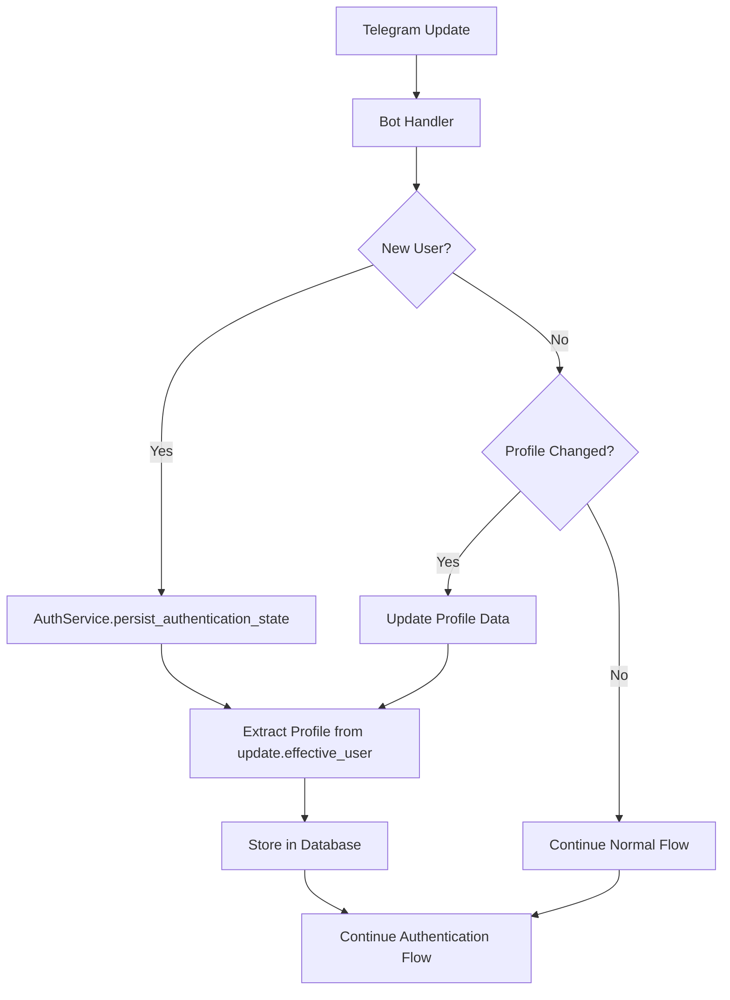

# Design Document

## Overview

This design extends the existing Users database table to capture additional Telegram user profile information (first_name, last_name, is_bot, is_premium, language_code) from the Telegram Update object. The implementation focuses on efficient data capture during user registration and selective updates to maintain system performance.

The design leverages the existing authentication flow and user management infrastructure, adding minimal overhead while providing rich user profiling capabilities for analytics and personalization features.

## Architecture

### Current System Integration Points

The user profile extension integrates with the existing system at these key points:

1. **AuthService._persist_authentication_state()** - Enhanced to capture profile data during user creation/authentication
2. **User Model** - Extended with new profile fields
3. **Database Schema** - New migration to add profile columns and indexes
4. **Bot Handler** - Optional profile update logic for existing users

### Data Flow



## Components and Interfaces

### 1. Database Schema Changes

**New Columns Added to Users Table:**
- `first_name: Text, nullable=True` - User's first name from Telegram
- `last_name: Text, nullable=True` - User's last name from Telegram  
- `is_bot: Boolean, default=False` - Whether the user is a bot account
- `is_premium: Boolean, nullable=True` - Whether the user has Telegram Premium
- `language_code: Text, nullable=True` - User's language preference (ISO 639-1)

**New Indexes:**
- `ix_users_language_code` - For language-based queries
- `ix_users_is_premium` - For premium user queries
- `ix_users_bot_premium` - Composite index on (is_bot, is_premium)

### 2. User Model Extension

```python
class User(Base):
    # ... existing fields ...
    
    # New profile fields
    first_name: Mapped[Optional[str]] = mapped_column(Text)
    last_name: Mapped[Optional[str]] = mapped_column(Text)
    is_bot: Mapped[bool] = mapped_column(Boolean, default=False)
    is_premium: Mapped[Optional[bool]] = mapped_column(Boolean)
    language_code: Mapped[Optional[str]] = mapped_column(Text)
```

### 3. Profile Data Extraction Utility

```python
def extract_user_profile(effective_user) -> dict:
    """Extract user profile data from Telegram effective_user object."""
    return {
        'first_name': getattr(effective_user, 'first_name', None),
        'last_name': getattr(effective_user, 'last_name', None),
        'is_bot': getattr(effective_user, 'is_bot', False),
        'is_premium': getattr(effective_user, 'is_premium', None),
        'language_code': getattr(effective_user, 'language_code', None)
    }
```

### 4. AuthService Enhancement

The `_persist_authentication_state` method will be enhanced to:
- Extract profile data during user creation
- Populate new profile fields for new users
- Optionally update profile data for existing users if significant changes detected

### 5. Profile Update Strategy

**For New Users:**
- Always capture all available profile data during first interaction

**For Existing Users:**
- Compare current database values with incoming Telegram data
- Update only if meaningful changes detected (name changes, premium status changes)
- Skip updates for minor/frequent changes to avoid unnecessary database writes

## Data Models

### Extended User Model

```python
class User(Base):
    __tablename__ = "users"

    # Existing fields
    id: Mapped[int] = mapped_column(primary_key=True)
    telegram_id: Mapped[int] = mapped_column(BigInteger, unique=True, nullable=False)
    email: Mapped[str] = mapped_column(Text, unique=True, nullable=False)
    email_original: Mapped[Optional[str]] = mapped_column(Text)
    is_authenticated: Mapped[bool] = mapped_column(Boolean, default=False)
    email_verified_at: Mapped[Optional[datetime]] = mapped_column(DateTime(timezone=True))
    last_authenticated_at: Mapped[Optional[datetime]] = mapped_column(DateTime(timezone=True))
    created_at: Mapped[datetime] = mapped_column(DateTime(timezone=True), default=func.now())
    updated_at: Mapped[datetime] = mapped_column(DateTime(timezone=True), default=func.now(), onupdate=func.now())
    
    # New profile fields
    first_name: Mapped[Optional[str]] = mapped_column(Text)
    last_name: Mapped[Optional[str]] = mapped_column(Text)
    is_bot: Mapped[bool] = mapped_column(Boolean, default=False)
    is_premium: Mapped[Optional[bool]] = mapped_column(Boolean)
    language_code: Mapped[Optional[str]] = mapped_column(Text)

    def __repr__(self) -> str:
        name_part = f", name='{self.first_name or 'Unknown'}'" if self.first_name else ""
        return f"<User(id={self.id}, telegram_id={self.telegram_id}, email='{self.email[:3]}***'{name_part})>"
```

### Profile Data Transfer Object

```python
@dataclass
class UserProfile:
    first_name: Optional[str] = None
    last_name: Optional[str] = None
    is_bot: bool = False
    is_premium: Optional[bool] = None
    language_code: Optional[str] = None
    
    def has_meaningful_changes(self, other: 'UserProfile') -> bool:
        """Check if profile has meaningful changes worth updating."""
        return (
            self.first_name != other.first_name or
            self.last_name != other.last_name or
            self.is_premium != other.is_premium or
            self.language_code != other.language_code
            # Note: is_bot typically doesn't change, but included for completeness
        )
```

## Error Handling

### Profile Extraction Errors
- **Missing effective_user**: Log warning, continue with empty profile data
- **Partial profile data**: Accept partial data, populate available fields
- **Invalid data types**: Use safe getattr with defaults, log warnings for unexpected values

### Database Update Errors
- **Profile update failures**: Log error but continue with authentication flow
- **Migration failures**: Provide rollback mechanism in Alembic migration
- **Index creation failures**: Ensure migration can complete without indexes if needed

### Backward Compatibility
- All new fields are nullable or have defaults
- Existing code continues to work without modification
- Migration preserves all existing data

## Testing Strategy

### Unit Tests
1. **Profile Extraction Tests**
   - Test extraction with complete Telegram user data
   - Test extraction with partial/missing data
   - Test extraction with None/invalid values

2. **Model Tests**
   - Test User model with new fields
   - Test model validation and constraints
   - Test __repr__ method with new fields

3. **AuthService Tests**
   - Test user creation with profile data
   - Test profile update logic
   - Test error handling during profile operations

### Integration Tests
1. **Migration Tests**
   - Test migration up/down operations
   - Test data preservation during migration
   - Test index creation and performance

2. **End-to-End Tests**
   - Test complete user registration flow with profile data
   - Test profile updates during subsequent interactions
   - Test system behavior with various Telegram user types (bots, premium users, etc.)

### Performance Tests
1. **Database Performance**
   - Test query performance with new indexes
   - Test migration performance on large datasets
   - Test profile update frequency impact

2. **Memory Usage**
   - Test memory impact of additional profile fields
   - Test profile extraction overhead

### Database Migration Testing
1. **Schema Validation**
   - Verify all columns added correctly
   - Verify indexes created successfully
   - Verify constraints applied properly

2. **Data Integrity**
   - Verify no data loss during migration
   - Verify existing functionality unchanged
   - Verify rollback capability

## Implementation Phases

### Phase 1: Database Schema and Model Updates
- Create Alembic migration for new columns and indexes
- Update User model with new profile fields
- Update model __repr__ method

### Phase 2: Profile Extraction and Storage
- Implement profile extraction utility
- Enhance AuthService to capture profile data during user creation
- Add profile update logic for existing users

### Phase 3: Testing and Validation
- Implement comprehensive test suite
- Perform migration testing on development database
- Validate performance impact

### Phase 4: Deployment and Monitoring
- Deploy migration to production
- Monitor system performance and error rates
- Validate profile data collection accuracy